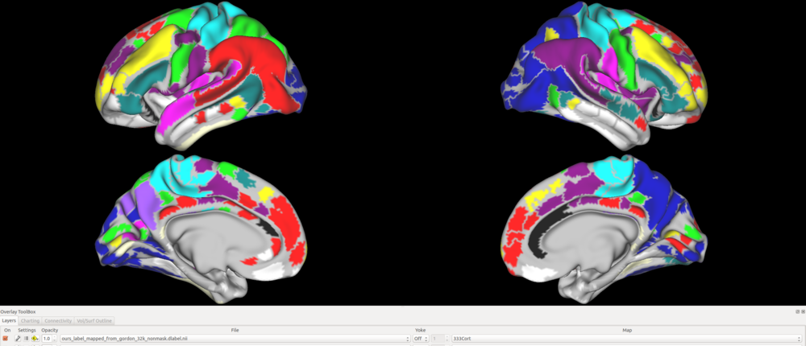

# Parcellation based on coactivation patterns (CAPs)

## Overview

  
Our parcellation results (threshold = 0.5)  
download [link](https://drive.google.com/drive/folders/1sl6Ny0WXPdQggUVoxCwfm2aEK5tBTCI8?usp=sharing)  

## Method

The parcellation procedure was the same as [Gordon et al., 2016](https://academic.oup.com/cercor/article/26/1/288/2367115). Instead of employing functional connectivity matrix (correlation matrix across voxels), we employed coactivation patterns which repeatedly appeared during rest ([Liu and Duyn 2013](https://www.pnas.org/content/110/11/4392)). 

### Preprocessing

We first extracted 3000 coactivation patterns from S1200 HCP dataset. For each of coactivation patterns, we calculated gradient map using cifti-gradient function. The obtained gradient maps are spatially smoothed (surface kernel =2.55 mm). 

### Main Method

Based on [Gordon et al., 2016](https://academic.oup.com/cercor/article/26/1/288/2367115),  
watershed algorithm was employed to identify boundaries in the gradient maps. These boundary maps from 3000 coactivation patterns were averaged to indicate the frequency with which a give vertex was identifeid as a boundary.

## Setting

1. Clone this repository.
2. Dowonload the data and results from [GoogleDrive](https://drive.google.com/drive/folders/1sl6Ny0WXPdQggUVoxCwfm2aEK5tBTCI8?usp=sharing)．
3. Move the data and results to the currenct directory of this repository．

## Data

```
./data
```

- Glassar
    ROI.mat (This file is just used for the template of the ROI file)
- Preproc  
    target_run1_all.dscalar.nii
- SurfFiles  
    S1200.L.midthickness_MSMAll.32k_fs_LR.surf.gii  
    S1200.R.midthickness_MSMAll.32k_fs_LR.surf.gii  
- Gordon_Data  
    node_neighbors.txt  
    medial_wall.L.32k_fs_LR.func.gii  
    medial_wall.R.32k_fs_LR.func.gii  
    L.atlasroi_erode3.32k_fs_LR.shape.gii  
    R.atlasroi_erode3.32k_fs_LR.shape.gii  
    Gordon333.32k_fs_LR.dlabel.nii
    
## Usage

### preprocessing

```
./code/preproc
```

1. cifti_gradient.sh
2. smooth.sh
3. sep_gradien_cap3000.sh
4. gifti2mat.m

```sh
bash cifti_gradient.sh
bash smooth.sh
bash sep_gradien_cap3000.sh
```

### ours-parcellation-method

```
./code/ours-parcellation-method
```

1. run_surface_parcellation.m  
    get L and R labels.mat, labels_avg.mat and results.mat  
2. run_parcel_creator.m  
    get L and R each threshold func.gii  (th = 0-1)

### summary

```
./code/summary
```

- create_glassor_roi.m
- create_gordon_roi.m
- create_ours_roi_L.m
- create_ours_roi_R.m

### visualization

```
./code/visualization
```

reformat label num to coordinate.

- ours_lable2coord.m
- gordon_label2coord.m

color mapping into Gordon

- find_Correspondence_labels.m
    - compare_distance_coord.m

save sample results (TH=0.5)  
save_ours_roi_data_dlabels.m  
ours_label_mapped_from_gordon_32k_nonmask.dlabel.nii

## Requirements

- Ubuntu (18.04.5 LTS)
- MATLAB (R2019)
- wb_command (Version: 1.2.3)

## Reference
- [gordon papers url](https://academic.oup.com/cercor/article/26/1/288/2367115)
- [gordon data and code](https://sites.wustl.edu/petersenschlaggarlab/files/2018/06/Gordon2016Surface_parcellation_distribute-20agwt4.zip)
- [workbench-command](https://www.humanconnectome.org/software/workbench-command)
- [BARSA](https://balsa.wustl.edu/file/show/976Nr)
- [cifti matlab](https://github.com/Washington-University/cifti-matlab)
